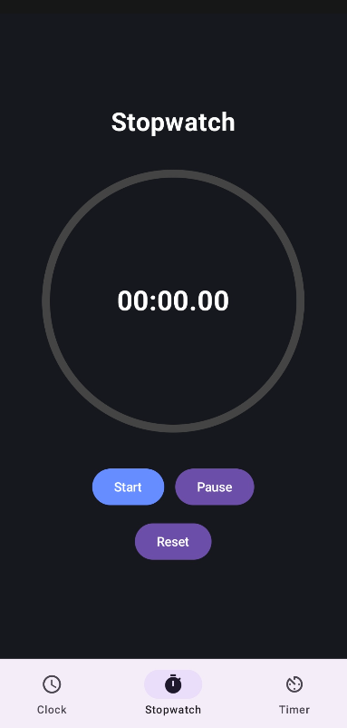
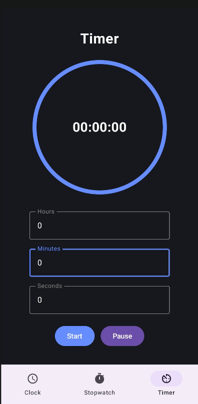

### TicTic 

TicTic is a modern Android clock application built using Kotlin and Jetpack Compose. The app combines essential time management features such as a digital clock, world clock, stopwatch, and countdown timer in a clean and user-friendly interface.

### Features

### World Clock

* View the current time in multiple cities.
* Add different time zones from a predefined list.
* Live time updates.

### Stopwatch

* Start, pause, and reset functionality.
* Circular animated progress indicator.
* Millisecond precision timing.

### Countdown Timer

* Set hours, minutes, and seconds.
* Circular countdown animation.
* Alarm notification and completion dialog when the timer finishes.

### Daily Quotes

* Displays a motivational quote that changes daily.

## Tech Stack

* Kotlin
* Jetpack Compose
* Material 3
* Navigation Compose
* Coroutines

## Screens

* Clock Screen
* Stopwatch Screen
* Timer Screen

## Future Improvements

* Persistent storage for saved world clocks
* Custom alarm sounds
* Lap functionality for stopwatch
* Enhanced neumorphic UI design
* Light and dark theme support

## Author

Built as a project to learn Android development and improve my Kotlin and Jetpack Compose skills.

##  Screenshots

  
  
  

